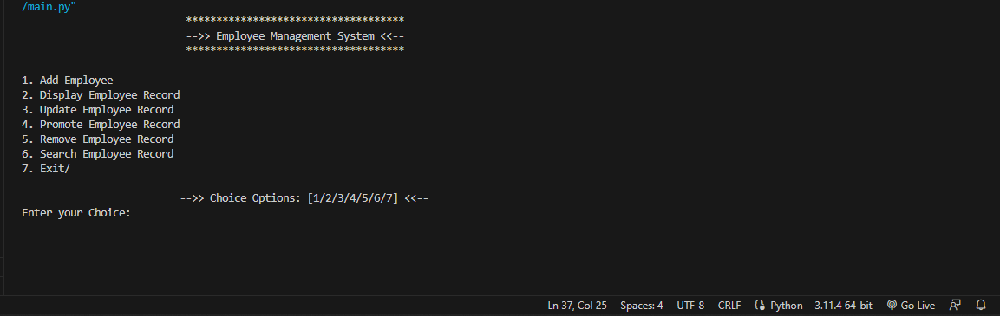
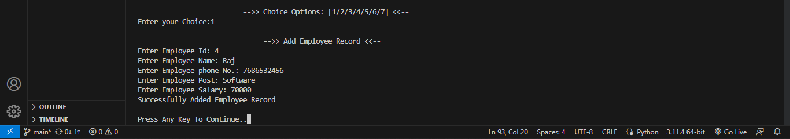

<h1 style="color:blue;">Employee Management System</h1>
Some ScreenShot are here:- 
<b>Main lending page in Terminal</b>
 
<b>ScreenShot of Add Employee</b>
 
etc..
 

For make This project we connected Mysql with python with some CLI in terminal. 
run this in terminal :- 
pip install mysql-connector-python 
python main.py  

<h6>"mysql> <b>mysql -u root -p</b></h6> 
Also made a Database: 
<b>CREATE DATABASE "database name";</b> 
<b>show Databases;</b>

